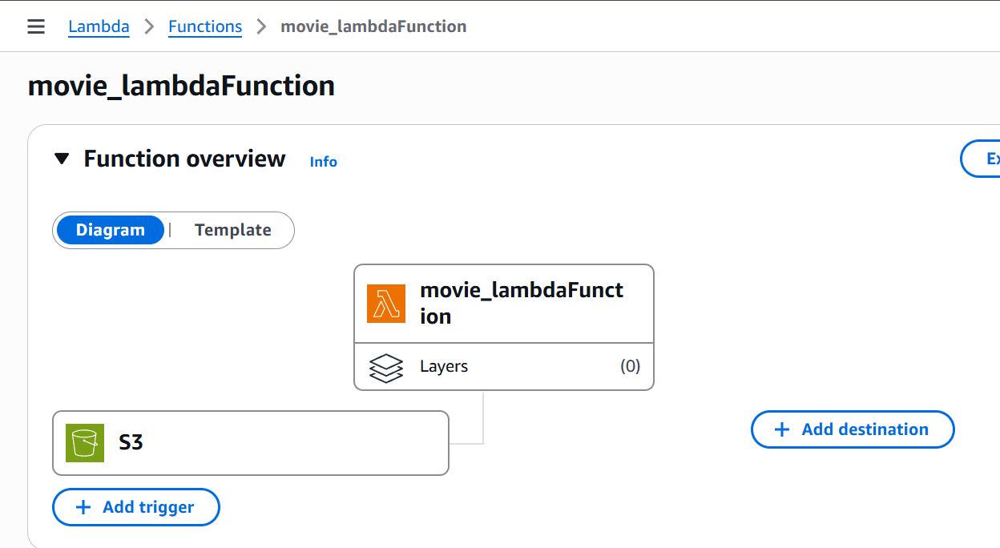
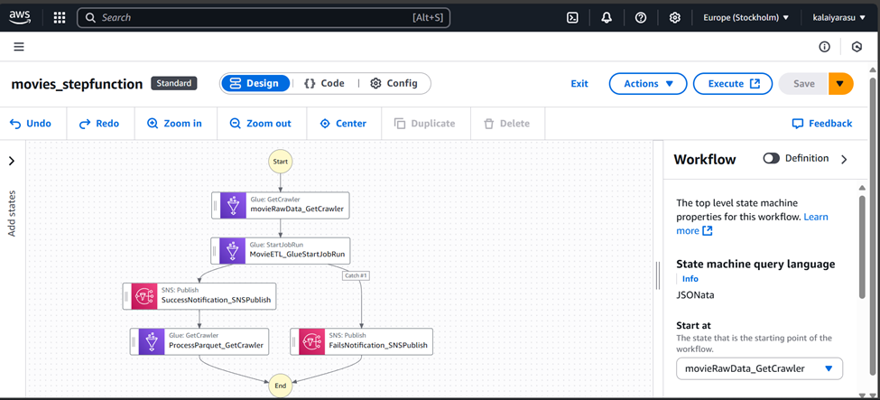
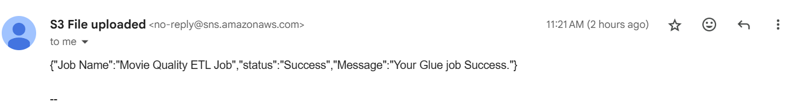
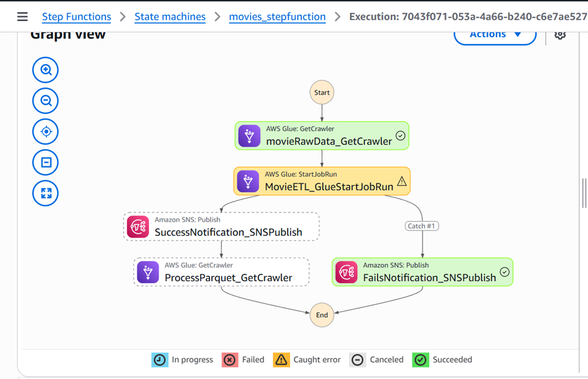
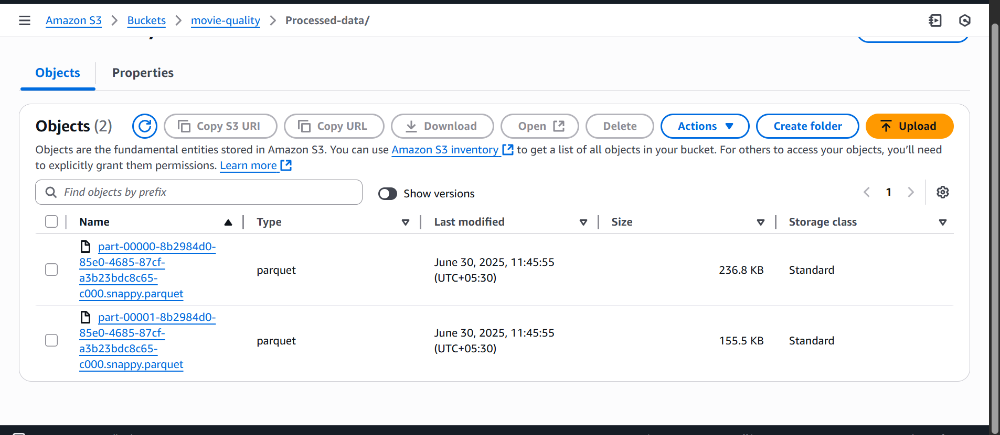
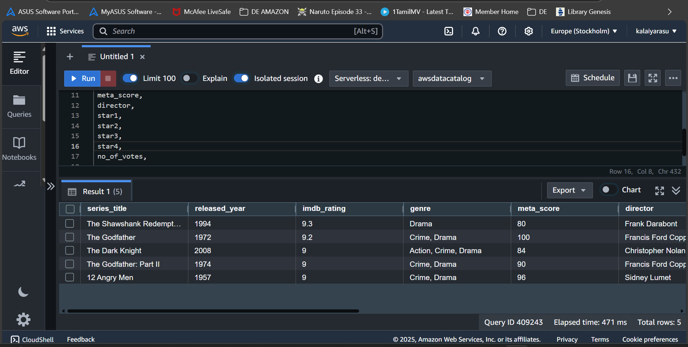

# AWS Movie Data Engineering Pipeline

This project demonstrates a complete serverless data engineering pipeline on AWS to process and validate raw movie metadata using Glue, Lambda, Step Functions, SNS, and Redshift.

---

## Project Overview

The pipeline performs the following steps:

1. Accepts **raw movie data** in CSV format uploaded to **Amazon S3**
2. **Triggers an AWS Lambda function** when a new file arrives
3. **Runs a Step Function** that orchestrates the workflow:
   - Crawls raw data
   - Runs a Glue ETL job for cleaning/processing
   - Sends success/failure **notifications via SNS**
   - Crawls the processed data
4. Creates a **Redshift Spectrum external table** from the processed data for analytics

---

## Architecture Diagram

arw_data in s3 --> lambda function (trigger) -- stepfunction 
													|
												start Crawler
												    |
												run glue job
													|
												if glue job fails or sucess -- send notification
																		|
																	run crawler for processed data
																		|
																	query from redshift
																	

---

## Dataset Schema

| Column Name     | Type     | Description |
|------------------|----------|-------------|
| Poster_Link      | string   | Poster image URL |
| Series_Title     | string   | Movie title |
| Released_Year    | int      | Year of release |
| Certificate      | string   | Film certificate (e.g., PG-13, R) |
| Runtime          | string   | Duration (e.g., "142 min") |
| Genre            | string   | Genre(s) |
| IMDB_Rating      | float    | IMDb rating |
| Overview         | string   | Short summary |
| Meta_score       | int      | Metacritic score |
| Director         | string   | Director’s name |
| Star1–Star4      | string   | Leading actors |
| No_of_Votes      | int      | Number of votes |
| Gross            | float    | Gross revenue |

---

## Raw Movie Data Upload to S3

- The pipeline starts when a raw `.csv` file is uploaded to:  
  `s3://movie-quality/Movie-RawData/`

---

## Step 1 – Lambda Trigger

- An **S3 event** triggers a **Lambda function**.
- The Lambda starts an **AWS Step Function** execution for the ETL pipeline.

---

## Step 2 – Step Function Orchestration

The Step Function performs the following in sequence:

1. **Run Glue Crawler** to catalog raw S3 data
2. **Run Glue Job** to:
   - Clean and validate movie data
   - Store output in `Processed-data/` folder in Parquet format
3. **Send notification** using **SNS** on job success or failure
4. **Run another Crawler** to catalog the processed data

## Notification 
- If the Glue Job fails or succeeds, an SNS topic sends email alerts to subscribed users

---

## Step 3 – Glue Job: Data Cleaning

- The Glue job:
  - Validates required fields
  - Filters bad records
  - Converts CSV to **Parquet**
  - Writes output to:  
    `s3://movie-quality/Processed-data/`

---

## Step 4 – Processed Data Crawler

- A second **Glue Crawler** scans the `Processed-data/` Parquet data
- Creates a new table: `spectrum_movies.processed_processed_data`

---

## Step 5 – Redshift External Table (Spectrum)

- Created an **external schema** in Redshift to access Glue Catalog tables:

CREATE EXTERNAL SCHEMA spectrum_movies
FROM data catalog
DATABASE 'movies'
IAM_ROLE 'IAM_ROLE 'arn:aws:iam::####:role/service-role/mazonRedshift-####''
CREATE EXTERNAL DATABASE IF NOT EXISTS;

SELECT 
series_title,
 released_year,
 imdb_rating, genre, 
 meta_score, 
 director, 
 star1,
 star2,
 star3,
 star4,
 no_of_votes,
 gross
from spectrum_movies.processed_processed_data
limit 5

